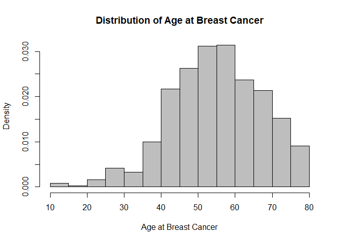
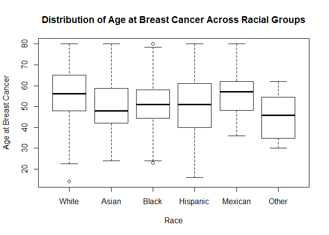
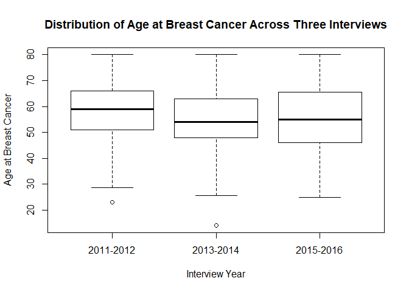

The Association of Smoking and the Risk of Developing Breast Cancer in the United States, Using NHANES 2011-16 Datasets
================
Sha Tao (st3117), Jingqi Song (js5165), Yixuan Wang (yw3095), Ditian Li (dl3157), Boya Guo (bg2604)
December 6, 2018

### Motivation and Related Works

Breast cancer is the most commonly diagnosed cancer among American women. It is estimated that about 1 in 8 U.S women will develop invasive breast cancer over the course of lifetime. An inverse association between smoking and breast cancer survival rate has been reported by many studies. A history of cigarette smoking can significantly increase the risk of breast cancer. However, there is a limited number of prior literatures investigate the association of smoking and breast cancer at a population level using national survey data. To address this knowledge gap, we conduct this secondary data analysis study on the National Health and Nutrition Examination Survey (NHANES) from year 2011 to 2016 to see if there is a trend of smoking and breast cancer risk across years in the United States.

The key predictor of interest was established using the question on “have you smoked at least 100 cigarettes in your entire life”. The outcome of this study used the question “what kind of cancer was it”. Other covariates include race, age, alcohol, overweight, income, and age at the first birth were identified based on literature review from Pubmed.

### Initial Research Questions:

Does the risk of breast cancer increases with heavy smoking in the United States, when controlling for other covariates?

### Data

**Source** We used the Demographics and Questionnaire data files from the NHANES 2011-2016 datasets (<https://wwwn.cdc.gov/nchs/nhanes/Default.aspx>). NHANES is a nationally representative, multi-stage complex survey designed to assess the health and nutritional status of the non-institutionalized, civilian US population.

``` r
# readin csv file with url
files = read_csv("./data/file_link.csv")

# demographics
demo = 
  files %>%  
  filter(str_detect(file_name, "DEMO")) %>% 
  mutate(map(.x = file_link, ~read_xpt(.x))) %>% 
  unnest %>% 
  select(file_name, id = SEQN, gender = RIAGENDR, age = RIDAGEYR, race = RIDRETH3, edu = DMDEDUC3, 
         six_month = RIDEXMON, birth_country = DMDBORN4, marital_status = DMDMARTL, 
         pregancy_at_exam = RIDEXPRG, strata = SDMVSTRA, psu = SDMVPSU, weight = WTINT2YR) %>% 
  mutate(year = as.factor(ifelse(str_detect(file_name, "_G") == TRUE, "2011-2012", 
                          ifelse(str_detect(file_name, "_H") == TRUE, "2013-2014", "2015-2016"))),
         weight = 1/3 * weight) %>% 
  select(id, year, gender:weight)

# cancer history
mcq = 
  files %>% 
  filter(str_detect(file_name, "MCQ")) %>% 
  mutate(map(.x = file_link, ~read_xpt(.x))) %>% 
  unnest %>% 
  select(file_name, id = SEQN, overweight = MCQ080, cancer_malignancy = MCQ220, cancer_code1 = MCQ230A, 
         cancer_code2 = MCQ230B, age_breast_cancer = MCQ240E, told_lose_weight = MCQ365A, 
         told_exercise = MCQ365B, told_reduce_fat = MCQ365D) %>% 
  mutate(year = as.factor(ifelse(str_detect(file_name, "_G") == TRUE, "2011-2012", 
                          ifelse(str_detect(file_name, "_H") == TRUE, "2013-2014", "2015-2016")))) %>% 
  select(id, year, overweight:told_reduce_fat)

# smoking history
smq = 
  files %>% 
  filter(str_detect(file_name, "SMQ")) %>% 
  mutate(map(.x = file_link, ~read_xpt(.x))) %>% 
  unnest %>% 
  select(file_name, id = SEQN, smoke_100 = SMQ020) %>% 
  mutate(year = as.factor(ifelse(str_detect(file_name, "_G") == TRUE, "2011-2012", 
                          ifelse(str_detect(file_name, "_H") == TRUE, "2013-2014", "2015-2016")))) %>% 
  select(id, year, smoke_100)

# hight / weight report
whq = 
  files %>% 
  filter(str_detect(file_name, "WHQ")) %>% 
  mutate(map(.x = file_link, ~read_xpt(.x))) %>% 
  unnest %>% 
  select(file_name, id = SEQN, self_height = WHD010, self_weight = WHD020, times_lost_ten_lb = WHQ225, 
         self_greaest_weight = WHD140, age_heaviest = WHQ150) %>% 
  mutate(year = as.factor(ifelse(str_detect(file_name, "_G") == TRUE, "2011-2012", 
                          ifelse(str_detect(file_name, "_H") == TRUE, "2013-2014", "2015-2016")))) %>% 
  select(id, year, self_height:age_heaviest)

# alcohol history
alq = 
  files %>% 
  filter(str_detect(file_name, "ALQ")) %>% 
  mutate(map(.x = file_link, ~read_xpt(.x))) %>% 
  unnest %>% 
  select(file_name, id = SEQN, alcohol = ALQ130) %>% 
  mutate(year = as.factor(ifelse(str_detect(file_name, "_G") == TRUE, "2011-2012", 
                          ifelse(str_detect(file_name, "_H") == TRUE, "2013-2014", "2015-2016")))) %>% 
  select(id, year, alcohol)
  
# reproduction
rhq = 
  files %>% 
  filter(str_detect(file_name, "RHQ")) %>% 
  mutate(map(.x = file_link, ~read_xpt(.x))) %>% 
  unnest %>% 
  select(file_name, id = SEQN, age_first_birth = RHD180) %>% 
  mutate(year = as.factor(ifelse(str_detect(file_name, "_G") == TRUE, "2011-2012", 
                          ifelse(str_detect(file_name, "_H") == TRUE, "2013-2014", "2015-2016")))) %>% 
  select(id, year, age_first_birth)

# incomce information
inq = 
  files %>% 
  filter(str_detect(file_name, "INQ")) %>% 
  mutate(map(.x = file_link, ~read_xpt(.x))) %>% 
  unnest %>% 
  select(file_name, id = SEQN, income = INDFMMPC) %>% 
  mutate(year = as.factor(ifelse(str_detect(file_name, "_G") == TRUE, "2011-2012", 
                          ifelse(str_detect(file_name, "_H") == TRUE, "2013-2014", "2015-2016")))) %>% 
  select(id, year, income)
```

**Scraping Method and Cleaning**

To investigate the association between obesity and risk of breast cancer across racial/ethnic groups from 2011 to 2016, we pooled the Demographics (demo), Weight History (whq), Medical Conditions (mcq), Smoking History (smq), Alcohol (alq), and Income (inq) data files for each survey cycle using the urls. Then, we merged and tidied our data. We recoded “refused” (7 or 77 or 777) “don't know” (9, 99, 999, 9999) responses as missing value. After we tidying our data, 8920 number of participants and 14 variables were included in the final dataset to analyze.

``` r
# replace "refused"" and "don't know" data as missing 
nhanes = merge(demo, merge(alq, merge(inq, merge(mcq, merge(rhq, merge(smq, whq)))))) %>% 
  replace_with_na(replace = list(birth_country = c(77, 99), marital_status = c(77, 99), overweight = c(7, 9),
                                 cancer_malignancy = c(7, 9), cancer_code1 = 99, age_breast_cancer = 99999,
                                 told_lose_weight = c(7, 9), told_exercise = c(7, 9), told_reduce_fat = c(7, 9),
                                 self_height = c(7777, 9999), self_weight = c(7777, 9999),
                                 times_lost_ten_lb = c(7, 9), self_greaest_weight = c(7777, 9999),
                                 age_heaviest = c(77777, 99999), smoke_100 = c(7, 9), alcohol = c(777, 999),
                                 income = c(7, 9), age_first_birth = c(777, 999)))
# tried replace_with_na_all() function but failed

# clean and choose the predictors and exposures
nhanes_model = 
  nhanes %>% 
  mutate(breast_cancer = ifelse(cancer_code1 == 14 | cancer_code2 == 14, 1, 0),
         breast_cancer = as.factor(ifelse(is.na(breast_cancer), 0, breast_cancer)),
         race = ifelse(race == 1, "Mexican",
                       ifelse(race == 2, "Hispanic",
                              ifelse(race == 3, "White",
                                     ifelse(race == 4, "Black",
                                            ifelse(race == 6, "Asian", "Other"))))),
         race = fct_relevel(as.factor(race), "White"),
         overweight = fct_relevel(as.factor(overweight), '2'),
         smoke_100 = fct_relevel(as.factor(smoke_100), '2'),
         income = fct_relevel(as.factor(income), '2'),
         bmi = (self_weight*0.453592)/(self_height*0.0254)^2) %>% 
  filter(gender == 2) %>% 
  select(id, year, age, race, breast_cancer, overweight, smoke_100, age_breast_cancer, alcohol, age_first_birth, 
         income, bmi, strata, psu, weight)
```

``` r
skimr::skim(nhanes_model)
```

    ## Skim summary statistics
    ##  n obs: 8920 
    ##  n variables: 15 
    ## 
    ## -- Variable type:factor ------------------------------------------------------------------------------------------------
    ##       variable missing complete    n n_unique
    ##  breast_cancer       0     8920 8920        2
    ##         income     565     8355 8920        3
    ##     overweight       4     8916 8920        2
    ##           race       0     8920 8920        6
    ##      smoke_100     152     8768 8920        2
    ##           year       0     8920 8920        3
    ##                                  top_counts ordered
    ##                      0: 8674, 1: 246, NA: 0   FALSE
    ##          3: 3890, 1: 3306, 2: 1159, NA: 565   FALSE
    ##                     2: 5445, 1: 3471, NA: 4   FALSE
    ##  Whi: 3205, Bla: 2068, Mex: 1247, Asi: 1093   FALSE
    ##                   2: 5919, 1: 2849, NA: 152   FALSE
    ##      201: 3101, 201: 2976, 201: 2843, NA: 0   FALSE
    ## 
    ## -- Variable type:numeric -----------------------------------------------------------------------------------------------
    ##           variable missing complete    n     mean       sd       p0
    ##                age       0     8920 8920    47.56    18.38    18   
    ##  age_breast_cancer    8676      244 8920    55.86    12.97    14   
    ##    age_first_birth    3885     5035 8920    22.2      4.93    14   
    ##            alcohol    4118     4802 8920     2.14     1.79     1   
    ##                bmi     347     8573 8920    28.45     7.31    14.14
    ##                 id       0     8920 8920 78315.31  9172.62 62164   
    ##                psu       0     8920 8920     1.53     0.55     1   
    ##             strata       0     8920 8920   111.26    12.94    90   
    ##             weight       0     8920 8920 13269.13 11657.91  1776.99
    ##       p25      p50      p75     p100     hist
    ##     32       47       62       80    <U+2587><U+2587><U+2587><U+2587><U+2586><U+2587><U+2586><U+2586>
    ##     47.75    56       65       80    <U+2581><U+2581><U+2582><U+2586><U+2587><U+2587><U+2586><U+2583>
    ##     19       21       25       43    <U+2583><U+2587><U+2583><U+2583><U+2582><U+2581><U+2581><U+2581>
    ##      1        2        3       30    <U+2587><U+2581><U+2581><U+2581><U+2581><U+2581><U+2581><U+2581>
    ##     23.03    27.27    32.28    77.94 <U+2583><U+2587><U+2585><U+2581><U+2581><U+2581><U+2581><U+2581>
    ##  69930.75 78955.5  86133    93702    <U+2587><U+2587><U+2585><U+2587><U+2587><U+2587><U+2587><U+2587>
    ##      1        2        2        3    <U+2587><U+2581><U+2581><U+2587><U+2581><U+2581><U+2581><U+2581>
    ##    100      111      123      133    <U+2587><U+2586><U+2586><U+2586><U+2586><U+2586><U+2586><U+2587>
    ##   5913.93  8639.98 15472.36 77918.61 <U+2587><U+2582><U+2581><U+2581><U+2581><U+2581><U+2581><U+2581>

After we built the model, we found there are 565 missing responses in income, 152 missing in smoking, 3885 missing in age at first birth, 4118 missing in alcohol, which may lead to potential bias in model comparison and estimation.

### Weighting in NHANES Dataset

Weights variables were created in NHANES dataset to analyze NHANES dataset to account for the complex survey design. NHANES survey consists initial in-home interview, Mobile Examination Centers (MEC) examinations and follow-up questionnaires. The base weights were adjusted for nonresponse to the in-home interview when creating interview weights, and further adjusted for non-response to the MEC exam when creating exam weights. Therefore, to correctly analyze NHANES dataset, we need to consider the effects of weighting on our sample to make a better estimate for the population before we start our analysis.

Based on the tutorial for National Health and Nutrition Examination Survey, we should select the weight of the smallest analysis subpopulation to produce estimates appropriately adjusted for survey non-response. Each NHANES survey cycle is divided into five sections labeled by collection method: Demographics, Dietary, Examination, Laboratory, and Questionnaire. This study only used variables from Demographics and Questionnaire (Weight History, Medical Conditions data files).

``` r
# Make Survey Design
design = svydesign(id = ~psu, strata = ~strata, data = nhanes_model, weights = ~weight, nest = TRUE)
```

Since the Demographics and Questionnaire data were both collected as part of the household interview, the sample weight for this study should be WTINT2YR, which is the full sample 2-year interview weight. The next step is to construct weights for combined NHANES survey cycles. For a 6-year data from 2011 to 2016, a weight should be constructed as ⅓ \*WTINT2YR. We renamed variable WTINT2YR as ‘weight’ and divided ‘weight’ by 3 to represent the weight from 2011-2016 only using the household interview data.

### Exploratory analysis:

Based on the literature review, we proposed three models using ‘svyglm’ and compared the AICs from these three models. The first model contains age, race and smoking as predictors; the second model includes only race and race; the third model contains age, race, smoking, overweight, alcohol, age at the first birth, and income. We found that the model 3 has a significant smaller AIC value (AIC = 833.398) compared to model 1 (AIC = 1850.594) and model 2 (AIC = 1853.784). Then we conducted a Wald hypothesis test comparing model 1 and model 3 and found p value is 0.39167, which suggested that the proposed model is similar to the full model. Based on the AIC values and the Wald test, we should use the proposed model instead.

``` r
# proposed model 1, smoking as main effect
model1 = svyglm(breast_cancer ~ age + race + smoke_100, family = "binomial", design = design)

# null model 2, include only age and race 
model2 = svyglm(breast_cancer ~ age + race, family = "binomial", design = design)

# full model 3, include all the variables mentioned in the reference
model3 = svyglm(breast_cancer ~ age + race + smoke_100 + overweight + alcohol + age_first_birth + income, family = "binomial", design = design)

# comparison of AIC between 3 models
tibble(
  model = c("model1", "model2", "model3"),
  AIC = c(summary(model1)$aic, summary(model2)$aic, summary(model3)$aic)) %>% 
  knitr::kable(digit = 3)
```

| model  |       AIC|
|:-------|---------:|
| model1 |  1850.594|
| model2 |  1853.784|
| model3 |   833.398|

``` r
# comparison between proposed model (model 1) and null model (model 2)
anova(model1, model2, method = "Wald")
```

    ## Wald test for smoke_100
    ##  in svyglm(formula = breast_cancer ~ age + race + smoke_100, family = "binomial", 
    ##     design = design)
    ## F =  3.201956  on  1  and  40  df: p= 0.081124

``` r
# p-value < 0.1, we can conclude that proposed mode is significantly better than null model

# comparison between proposed model (model 1) and null model (model 3)
anova(model1, model3, method = "Wald")
```

    ## Wald test for overweight alcohol age_first_birth income
    ##  in svyglm(formula = breast_cancer ~ age + race + smoke_100 + overweight + 
    ##     alcohol + age_first_birth + income, family = "binomial", 
    ##     design = design)
    ## F =  1.073669  on  5  and  35  df: p= 0.39167

``` r
# p-value > 0.1, we can conclude that proposed mode is similar to the full model
```

Again, the proposed model (model 1) with smoking as the main effect is significantly better than the null model at alpha = 0.1 level, while the proposed model is similar to the full model. Thus, it is reasonable to use the proposed model.

``` r
broom::tidy(model1) %>% 
  mutate(OR = exp(estimate),
         conf.low = exp(estimate - 1.645 * std.error),
         conf.high = exp(estimate + 1.645 * std.error)) %>% 
  select(term, beta = estimate, p.value, OR, conf.low, conf.high) %>% 
  knitr::kable(digit = 3)
```

| term         |    beta|  p.value|     OR|  conf.low|  conf.high|
|:-------------|-------:|--------:|------:|---------:|----------:|
| (Intercept)  |  -7.696|    0.000|  0.000|     0.000|      0.001|
| age          |   0.071|    0.000|  1.073|     1.065|      1.082|
| raceAsian    |  -0.125|    0.681|  0.883|     0.538|      1.448|
| raceBlack    |  -0.334|    0.088|  0.716|     0.523|      0.980|
| raceHispanic |   0.092|    0.684|  1.096|     0.759|      1.584|
| raceMexican  |  -0.473|    0.059|  0.623|     0.418|      0.929|
| raceOther    |  -0.332|    0.605|  0.718|     0.252|      2.045|
| smoke\_1001  |   0.358|    0.081|  1.431|     1.029|      1.988|

Then we computed the our odds ratio estimate and confidence interval using a 10% level of significance. We found that the odds of getting breast cancer among women who had smoked is 1.431 times the odds comparing to the ones who had not smoked controlling for age and race. The true odds ratio lies between 1.029 and 1.988.

Visualization
-------------

Since we should consider the effect of weighting for NHANES data, strata and cluster data are not the same as the raw data. Therefore, we have to use the 'svyplot' function for visualization.

``` r
# Distribution of Age at Breast Cancer
svyhist(~nhanes_model$age_breast_cancer, breaks = c(10, 15, 20, 25, 30, 35, 40, 45, 50, 55, 60, 65, 70, 75, 80), col = "grey", design, main = "Distribution of Age at Breast Cancer", xlab = "Age at Breast Cancer")
```



``` r
# Distribution of Age at Breast Cancer Across Racial Groups
svyboxplot(age_breast_cancer ~ race, design, xlab = "Race", ylab = "Age at Breast Cancer",
           main = "Distribution of Age at Breast Cancer Across Racial Groups")
```



``` r
# Distribution of Age at Breast Cancer Across Three Interviews
svyboxplot(age_breast_cancer ~ year, design, xlab = "Interview Year", ylab = "Age at Breast Cancer", 
           main = "Distribution of Age at Breast Cancer Across Three Interviews")
```



-   The histogram plot "Distribution of Age at Breast Cancer"showed that women within 50 - 60 age group have the highest risk of getting breast cancer than the other age group.

-   The boxplot "Distribution of Age at Breast Cancer Across Racial Groups" showed that Asian and 'Other' race group have relatively earlier breast cancer onset, while White and Mexican American have a later breast cancer onset.
-   The boxplot "Distribution of Age at Breast Cancer Across Three Interviews" indicated that the age of women getting breast cancer are similar in three interview period.

Result
------

The odds of getting breast cancer among women who had smoked is 1.431 times the odds comparing to the ones who had not smoked controlling for age and race. The true odds ratio lies between 1.029 and 1.988.

Discussion
----------

-   Since we are using NHANES data, which is normally analyzed using SAS, we encountered some difficulties while applying the survey design function.
-   Some of the variables we want, for example, family history of breast cancer, do not exist in the dataset. Also, the definitions and question regarding some variables were not as clear or as what we expected.
-   We’re not able to use ggplot and plotly on our dataset due to the fact that it is a survey data with cluster and weighting for each observations and different datasets. We have to rely on "svyplot". In addition, our outcome and most of our predictors are categorical, which makes it hard for us to make informative plots.Despite of the challenges and limitations above, our results show that the smoking is a significant predictor for breast cancer across the years. The odds of getting breast cancer among women who had smoked is almost 1.5 times the odds comparing to the ones who had not smoked controlling for age and race.

References
----------

1.  Bandera, Elisa V., et al. "Racial and Ethnic Disparities in the Impact of Obesity on Breast Cancer Risk and Survival: A Global Perspective–." *Advances in Nutrition 6.6 (2015): 803-819.* <https://academic.oup.com/advances/article/6/6/803/4555151>
2.  Chlebowski, Rowan T., et al. "Ethnicity and breast cancer: factors influencing differences in incidence and outcome." *Journal of the National Cancer Institute 97.6 (2005): 439-448.* <https://academic.oup.com/jnci/article/97/6/439/2544155>
3.  Picon‐Ruiz, Manuel, et al. "smoking and adverse breast cancer risk and outcome: mechanistic insights and strategies for intervention." *CA: a cancer journal for clinicians 67.5 (2017): 378-397.* <https://onlinelibrary.wiley.com/doi/full/10.3322/caac.21405>
4.  Module 3: Weighting. National Center for Health Statistics. Centers for Disease Control and Prevention. Retrieved from <https://wwwn.cdc.gov/nchs/nhanes/tutorials/Module3.aspx>
5.  Kispert, S., & McHowat, J. (2017). Recent insights into cigarette smoking as a lifestyle risk factor for breast cancer. Breast Cancer: Targets and Therapy, 9, 127.
